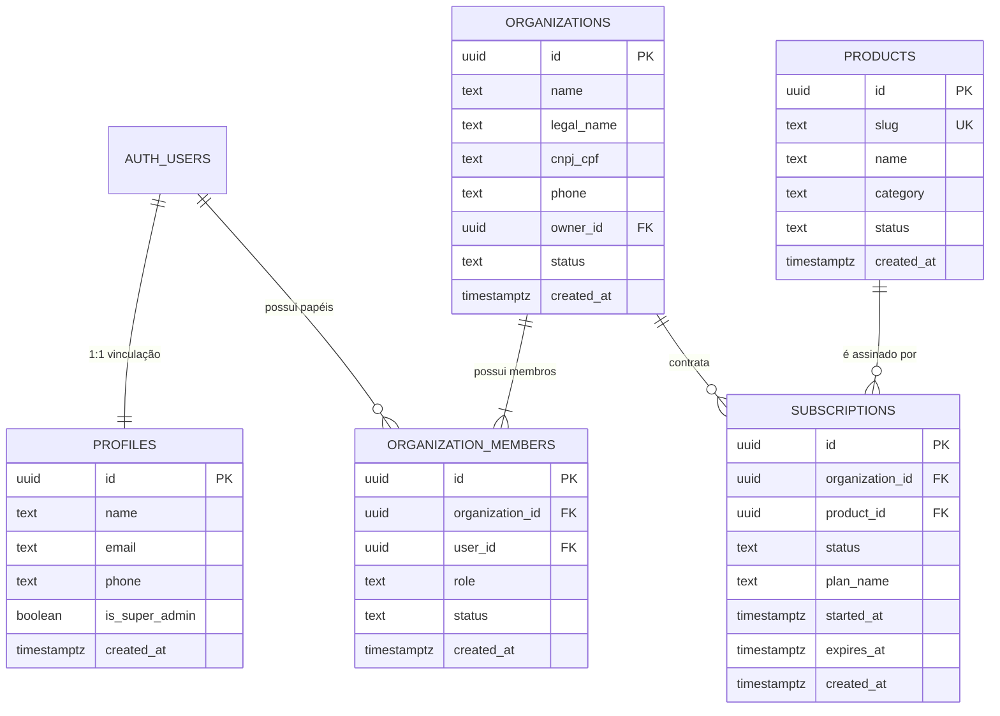

# 🏛️ Documento de Arquitetura Central — Kryon Systems
**Projeto:** Sistemas Kryon  
**Versão:** 1.0.0 (Etapa 1 — Fundação Multi-Tenant & Multi-Produto)  
**Data:** 03 de Setembro de 2026  

---

## 1. 🎯 Objetivo da Infraestrutura Central

A infraestrutura central da **Kryon Systems** foi projetada para suportar de forma unificada todo o ecossistema de soluções SaaS especializadas da empresa. 

Com essa fundação, uma única organização (empresa cliente) pode contratar um ou mais produtos Kryon, mantendo controle centralizado de usuários, permissões e assinaturas, com **isolamento absoluto de dados via Row Level Security (RLS)**.

---

## 2. 📦 Catálogo Central de Produtos Cadastrados

| # | Slug Oficial | Nome Comercial | Categoria / Nicho | Status |
|---|---|---|---|---|
| **1** | `kryon-utilidades` | **Kryon Utilidades** | `LOJA DE UTILIDADES` | `active` |
| **2** | `kryon-agenda` | **Kryon Agenda** | `AGENDAMENTO ONLINE` | `active` |
| **3** | `kryon-pet` | **Kryon Pet** | `PET SHOP` | `active` |
| **4** | `kryon-celular` | **Kryon Celular** | `LOJA DE CELULARES` | `active` |
| **5** | `kryon-moda` | **Kryon Moda` | `LOJA DE ROUPAS` | `active` |
| **6** | `kryon-fotos-studio-pro` | **Kryon Fotos — Studio Pro** | `FOTÓGRAFOS` | `active` |
| **7** | `kryon-lava-rapido` | **Kryon Lava Rápido** | `LAVA RÁPIDO` | `active` |
| **8** | `kryon-decor` | **Kryon Decor** | `LOJA DE DECORAÇÃO` | `active` |
| **9** | `kryon-auto` | **Kryon Auto** | `OFICINA MECÂNICA` | `active` |
| **10**| `kryon-juridico` | **Kryon Jurídico** | `ADVOGADOS` | `active` |

---

## 3. 🧩 Modelo de Dados Central (Core Schema)

---

## 4. 🛡️ Políticas de Segurança e Isolamento (RLS)

1. **Isolamento por Organização:** Usuários autenticados só conseguem visualizar e manipular dados pertencentes às organizações nas quais possuem associação ativa na tabela `organization_members`.
2. **Perfis Protegidos:** Cada usuário só pode visualizar e editar seu próprio registro em `public.profiles`.
3. **Catálogo de Produtos:** Acesso público somente-leitura (`SELECT true`) para permitir renderização de páginas de preços e vitrines sem exigir login prévio.
4. **Assinaturas:** O acesso aos módulos de software é validado pela existência de uma `subscription` com `status = 'active'` ou `status = 'trial'`.

---

## 5. 🚀 Próximos Passos (Plano de Migração Gradual)

- **Fase 1 (Atual - Concluída):** Fundação e catálogo central versionados em script SQL idempotente.
- **Fase 2 (Piloto Futuro):** Testar a conexão do primeiro produto piloto (ex: Kryon Lava Rápido ou Kryon Moda) com o banco central.
- **Fase 3 (Expansão Gradual):** Conectar os demais produtos um a um sem interrupção de serviço.
